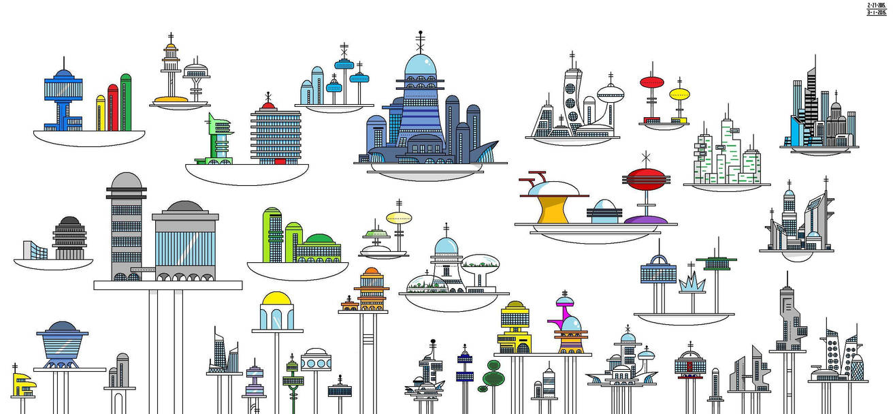

#  

** Actualmente trabajando en el área de TI en el sector educativo **

# Quien soy

- :wave: Hola, Soy @hcalmur
- :eyes: Mis pasatiempos favoritos son el biale :dancer: y la lectura :books:
- :seedling: Actualmente estoy en cursos sobre ciberseguridad

# Contacto

# Habilidades

<!---
hcalmur/hcalmur is a ✨ special ✨ repository because its `README.md` (this file) appears on your GitHub profile.
You can click the Preview link to take a look at your changes.
--->
